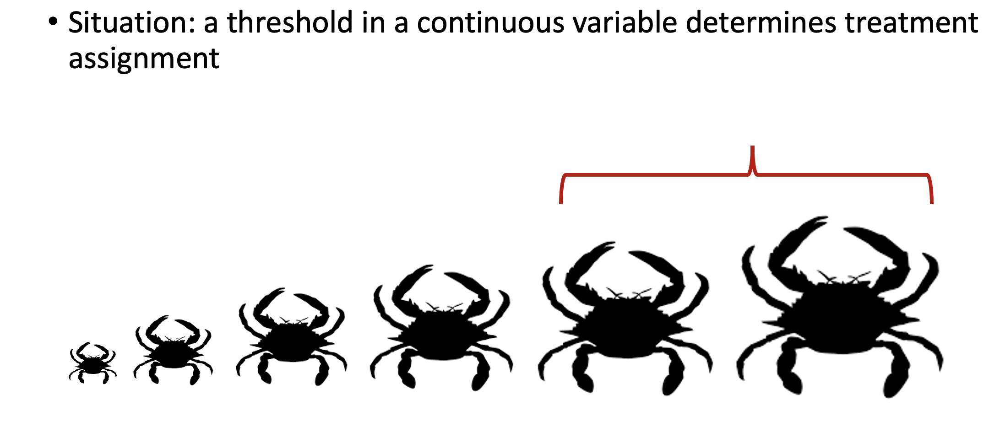

<!-- https://rpubs.com/phle/r_tutorial_regression_discontinuity_design -->

```{r setup, include=FALSE}
knitr::opts_chunk$set(echo = TRUE)
```

# The key concept

A threshold in a continuous variable determines treatment assignment 

Running variable (or “score”), X: a continuously distributed variable with a clearly defined cutoff (c) that determines which units are assigned to treatment and which ones are assigned to control.

Prior to the treatment, the outcome should not differ between the treatment and control group (*continuity assumption*). The distribution of the variable which indicates the threshold should have no jumps around this cutoff value.


# Theory

### There are two different variants of the RDD:

> * sharp RDD: the threshold separates the treatment and control group exactly
>
> * fuzzy RDD: the threshold influences the probability of being treated.  this is in fact an instrumental variable approach (estimating a Local Average Treatment Effect [LATE])

The value of the outcome (Y) for individuals just below the threshold is the missing conterfactual outcome. It increases continuously with the cutoff variable, as opposed to the treatment.

### Advantages of RDD
With an RDD approach some assumptions can be tested. Individuals or units close to the threshold are nearly identical, except for characteristics which are affected by the treatment.

RDD's strengths include that we can:

* illustrate the design graphically
* test some of the underlying assumptions and support arguments through data visualization
* reliably (unbiased) estimates local average treatment effects
* include relevant confounders in model

<!-- ### Estimation methods -->
<!-- Three methods to estimate a RDD can be distinguished: -->

<!-- Method 1: -->

<!-- select a subsample for which the value of the running variable is close to the threshold -->
<!-- problem: the smaller the sample, the larger the standard errors -->
<!-- Method 2: -->

<!-- select a larger sample and estimate parametrically -->
<!-- problem: this depends on the functional form and polynomials -->
<!-- Method 3: -->

<!-- select a subsample close to the threshold and estimate parametrically -->
<!-- extension: different functional forms on the left and right side of the cutoff -->


# Application Demo 

Load required packages. In this demo, we will use the package "rdrobust" 
```{r message=FALSE, warning=FALSE}
install.packages("rdrobust",
                 repos = "http://cran.us.r-project.org")
install.packages("rddensity",
                 repos = "http://cran.us.r-project.org")
```

```{r load-libraries, message=FALSE, warning=FALSE}
library(tidyverse)  # ggplot(), %>%, mutate(), and friends
library(broom)  # Convert models to data frames
library(rdrobust)  # For robust nonparametric regression discontinuity
library(rddensity)  # For nonparametric regression discontinuity density tests
library(modelsummary)  # Create side-by-side regression tables
```

### simulate data
```{r}
### Make column for observation ID
crab_data <- data.frame(id = seq(1, 1000),
                 
                 ### Add columns for explanatory variables
                 
                 ### Add column for treatment variable
                 fished = c(rep(0, 500), rep(1, 500)),
                 
                 ### Add column for body size
                 size = c(runif(500, min = 10, max = 80),
                          runif(500, min = 60, max = 130)),
                 
                 ### And the rest of the covariates
                 sst = runif(1000, min = 10, max = 16),
                 salinity = runif(1000, min = 1, max = 10),
                 npp = runif(1000, min = 0, max = 1),
                 
                 ### And the error term
                 error = rnorm(1000, mean = 0, sd = 2))

### Visualize
ggplot(crab_data) +
  geom_boxplot(aes(x = size, group = fished)) +
  geom_vline(xintercept = 70)

### center size at legal catch size
crab_data <- crab_data %>%
  mutate(size_centered = size - 70)
  
### Make column for outcome variable (total mortality) 
crab_data <- crab_data %>%
  mutate(natural_mortality = 10 + -0.4*size_centered + 2*sst + 0.3*npp + 1.5*salinity + error,
         fishing_mortality = ifelse(size_centered < 0 & fished == 0, 
                                    10 + -0.1*size_centered,
                                    ifelse(size_centered < 0 & fished == 1,
                                           30 + 0.4*size_centered,
                                           ifelse(size_centered > 0 & fished == 0,
                                                  10 + -0.1*size_centered,
                                                  30 + 0.4*size_centered))),
         total_mortality = natural_mortality + fishing_mortality)

### Visualize mortality outcomes   
ggplot(crab_data) + 
  geom_point(aes(x = size_centered,
                 y = natural_mortality,
                 color = fished))
ggplot(crab_data) + 
  geom_point(aes(x = size_centered,
                 y = fishing_mortality,
                 color = fished))
ggplot(crab_data) +
  geom_point(aes(x = size_centered,
                 y = total_mortality,
                 color = fished))

### Visualize covariates
ggplot(crab_data) +
  geom_point(aes(x = size_centered, 
                 y = sst,
                 color = fished))
ggplot(crab_data) +
  geom_point(aes(x = size_centered, 
                 y = salinity,
                 color = fished))
ggplot(crab_data) +
  geom_point(aes(x = size_centered, 
                 y = npp,
                 color = fished))
```
### Simple example
```{r, include=TRUE}
x<-runif(1000,-1,1)
y<-5+3*x+2*(x>=0)+rnorm(1000)
rdrobust(y,x)
```

<!-- ### Simulate Data -->
<!-- <!-- from https://www.jepusto.com/rdd-interactions/ --> -->
<!-- ```{r, include=TRUE} -->
<!-- set.seed(20160124) -->
<!-- simulate_RDD <- function(n = 2000, R = rnorm(n, mean = qnorm(.2))) { -->
<!--   n <- length(R) -->
<!--   T <- as.integer(R > 0) -->
<!--   X1 <- 10 + 0.6 * (R - qnorm(.2)) + rnorm(n, sd = sqrt(1 - 0.6^2)) -->
<!--   X2 <- sample(LETTERS[1:4], n, replace = TRUE, prob = c(0.2, 0.3, 0.35, 0.15)) -->
<!--   Y0 <- 0.4 * R + 0.1 * (X1 - 10) + c(A = 0, B = 0.30, C = 0.40, D = 0.55)[X2] + rnorm(n, sd = 0.9) -->
<!--   Y1 <- 0.35 + 0.3 * R + 0.18 * (X1 - 10) + c(A = -0.50, B = 0.30, C = 0.20, D = 0.60)[X2] + rnorm(n, sd = 0.9) -->
<!--   Y <- (1 - T) * Y0 + T * Y1 -->
<!--   data.frame(R, T, X1, X2, Y0, Y1, Y) -->
<!-- } -->

<!-- RD_data <- simulate_RDD(n = 2000) -->
<!-- ``` -->

## Step 1: Determine if process of assigning treatment is rule-based

```{r housing, fig.cap="Example: Rule-based Cut off example with fishing size limits of crabs", out.width='70%', echo=F }

```

We are interested in the causal effect of fishing on crab mortality. This question is surprisingly hard to answer because it's hard to tease apart natural mortality from fishing mortality, but it is an important effect to estimate for fisheries management. 
 
In order to be legally harvest, crabs must be larger than 70mm. Crabs smaller than 70mm are not legal to harvest. Harvesting is thus rule-based, according to size. Here, we would probably expect mortality to decline with body size, but the harvest rule changes this relationship at the discontinuity.

<!-- In order to join the tutoring program,  students have to score 70 points or lower on the entrance exam. Students who score higher than 70 are not eligible for the program. Since we have a clear 70-point rule, we can assume that the process of participating in the tutoring program is rule-based. -->

## Step 2: Determine if the design is fuzzy or sharp

Since we know that the program was applied based on a rule, we next want to figure out how strictly the rule was applied (e.g. was there a lot of illegal harvest of crabs that were too small?).The threshold was 70 mm for legal harvest — e.g., did people who caught crabs that scored 68 mm slip through cracks? The easiest way to check this is with a graph, and we can get exact numbers with a table. 

<!-- The threshold was 70 points on the test—did people who scored 68 slip through bureaucratic cracks and not participate, or did people who scored 73 sneak into the program? The easiest way to check this is with a graph, and we can get exact numbers with a table. -->


```{r check-fuzzy-sharp}
ggplot(tutoring, aes(x = entrance_exam, y = tutoring, color = tutoring)) +
  # Make points small and semi-transparent since there are lots of them
  geom_point(size = 0.5, alpha = 0.5,
             position = position_jitter(width = 0, height = 0.25, seed = 1234)) +
  # Add vertical line
  geom_vline(xintercept = 70) +
  # Add labels
  labs(x = "Entrance exam score", y = "Participated in tutoring program") +
  # Turn off the color legend, since it's redundant
  guides(color = "none")
```

This looks pretty sharp—it doesn't look like people who scored under 70 participated in the program. We can verify this with a table. There are no people where `entrance_exam` is greater than 70 and `tutoring` is false, and no people where `entrance_exam` is less than 70 and `tutoring` is true.

## Step 3: Check for discontinuity in running variable around cutpoint

```{r fuzzy-sharp-table}
tutoring %>%
  group_by(tutoring, entrance_exam <= 70) %>%
  summarize(count = n())
```

Based on the table, we can conclude this is a sharp design.

## Step 4: Check for discontinuity in outcome across running variable

Next, we need to see if any crabs self selected on either side of the size threshold; this seems unlikely. But, first, we'll make a histogram of the running variable (size) and see if there are any big jumps around the threshold:

```{r check-running-discontinuity}
ggplot(tutoring, aes(x = entrance_exam, fill = tutoring)) +
  geom_histogram(binwidth = 2, color = "white", boundary = 70) +
  geom_vline(xintercept = 70) +
  labs(x = "Entrance exam score", y = "Count", fill = "In program")
```

Here it doesn't look like there's a jump around the cutoff—there's a tiny visible difference between the height of the bars right before and right after the 70-mm sie threshold, but it seems to follow the general shape of the overall distribution.

## Step 5: Measure the size of the effect

There's a discontinuity, but how big is it? And is it statistically significant?

We can check the size two different ways: parametrically (i.e. using `lm()` with specific parameters and coefficients), and nonparametrically (i.e. not using `lm()` or any kind of straight line and instead drawing lines that fit the data more precisely). We'll do it both ways.

### Parametric estimation

First we'll do it parametrically by using linear regression. Here we want to explain the variation in final scores based on the entrance exam score and participation in the tutoring program:

$$
\text{Exit exam} = \beta_0 + \beta_1 \text{Entrance exam score}_\text{centered} + \beta_2 \text{Tutoring program} + \epsilon
$$

### Nonparametric estimation

Instead of using linear regression to measure the size of the discontinuity, we can use nonparametric methods. Essentially this means that R will not try to fit a straight line to the data—instead it'll curve around the points and try to fit everything as smoothly as possible.

The `rdrobust()` function makes it really easy to measure the gap at the cutoff with nonparametric estimation. Here's the simplest version:

## Fuzzy RDD
This is likely a fuzzy RDD set up: some crabs < 70mm are probably harvested illegally, and fishers are not catching every crab > 70mm. So the treatment assigned is not necessarily the treatment received. To estimate the effect of fishing on total crab mortality in a fuzzy RDD, we take a two stage least squares approach:

### analyze using fuzzy RDD
```{r}

```


